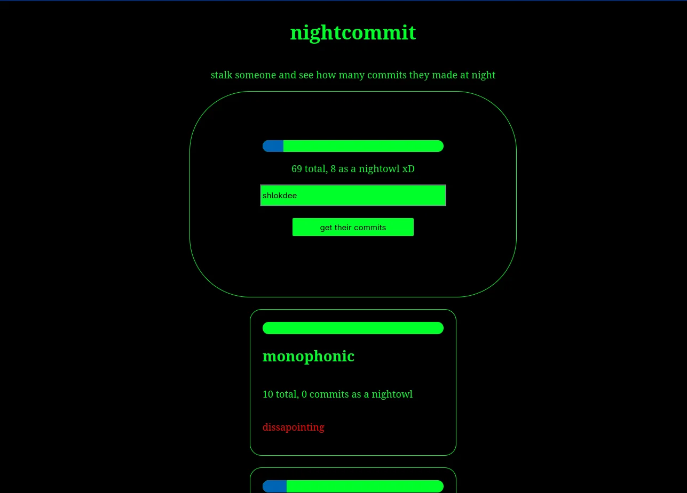

# nightcommit

A tool to see how much of a night owl you are!

nightcommit is a web based tool that uses the github api to let you check how any commits any user has made to their public projects at midnight! 

made for hack club- 3am

i got a random idea while signing up for 3am, how much do ppl actually code at night? it fit perfectly with the 3am theme, and i always wanted to build a website with a black background and the "hacker green" color... 

this is built using vanilla html css and js. it basically uses the github api to get the user's public repositories, and commit times, and displays it on the page. it also judges you based on ur night owl ness xD...

just head over to (this page)[https://shlokdee.github.io/nightcommit] to try it out! just enter any github username in the field, and click the button. also, pls try not to search too many users quickly, github rate limits your ip...